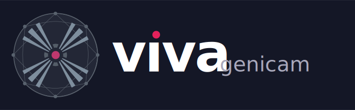

<p align="center">
  
</p>

<p align="center">
  Pure Rust building blocks for <b>GenICam</b> with an <b>Ethernet-first (GigE Vision)</b> focus.
</p>

<p align="center">
  <a href="https://github.com/VitalyVorobyev/genicam-rs/actions/workflows/ci.yml"></a>
  <a href="https://crates.io/crates/viva-genicam"></a>
  <a href="https://docs.rs/viva-genicam"></a>
  <a href="LICENSE"></a>
</p>

> **Disclaimer** -- Independent open-source Rust implementation of GenICam-related standards.
> Not affiliated with, endorsed by, or the reference implementation of EMVA GenICam.
> GenICam is a trademark of EMVA.

---

## Features

- **Discovery** -- find GigE Vision cameras on any network interface via GVCP broadcast
- **Control** -- read and write device registers and GenApi features (Integer, Float, Enum, Boolean, Command, String, SwissKnife, Converter)
- **Streaming** -- receive image frames over GVSP with packet resend, reassembly, and backpressure
- **Events & actions** -- subscribe to camera events; trigger synchronized acquisition via action commands
- **Time & chunks** -- map device timestamps to host time; parse chunk data (timestamp, exposure, gain)
- **Service bridge** -- expose cameras over [Zenoh](https://zenoh.io/) for [genicam-studio](https://github.com/VitalyVorobyev/genicam-studio)
- **No hardware required** -- built-in fake cameras (`viva-fake-gige`, `viva-fake-u3v`) for testing and demos

## Current status

- GigE Vision: fully functional (discovery, control, streaming, events, actions, chunks)
- USB3 Vision: transport layer implemented, integration in progress
- GenApi: Tier-1 + Tier-2 nodes including pValue delegation and SwissKnife expressions
- Self-contained integration tests (no external tools or hardware)

## Workspace layout

```
crates/
  viva-gencp/          GenCP encode/decode (transport-agnostic)
  viva-gige/           GigE Vision transport (GVCP/GVSP)
  viva-u3v/            USB3 Vision transport
  viva-genapi-xml/     GenICam XML parser
  viva-genapi/         GenApi node map & evaluation engine
  viva-genicam/        Public API facade (start here)
  viva-pfnc/           Pixel Format Naming Convention tables
  viva-sfnc/           Standard Feature Naming Convention constants
  viva-zenoh-api/      Shared Zenoh wire types (no Zenoh dependency)
  viva-service/        Zenoh bridge: GigE cameras -> genicam-studio
  viva-service-u3v/    Zenoh bridge: U3V cameras -> genicam-studio
  viva-camctl/         CLI binary
  viva-fake-gige/      Fake GigE camera for testing
  viva-fake-u3v/       Fake U3V camera for testing
```

## Quick start

```bash
cargo add viva-genicam
```

```rust
use viva_genicam::{gige, Camera};
use std::time::Duration;

#[tokio::main]
async fn main() -> Result<(), Box<dyn std::error::Error>> {
    // Discover cameras on the network
    let devices = gige::discover(Duration::from_secs(1)).await?;
    println!("Found {} cameras", devices.len());

    // Connect to the first camera
    let (mut camera, _xml) = viva_genicam::connect_gige(&devices[0]).await?;

    // Read and write features
    let exposure = camera.get("ExposureTime")?;
    println!("ExposureTime = {exposure}");
    camera.set("ExposureTime", "5000")?;
    Ok(())
}
```

## Documentation

- **[Book (mdBook)](https://vitalyvorobyev.github.io/genicam-rs/)** -- tutorials, architecture, networking cookbook
- **[API reference (docs.rs)](https://docs.rs/viva-genicam)** -- generated Rust API docs
- **[Examples](crates/viva-genicam/examples/)** -- 17 runnable examples covering discovery, streaming, events, chunks, and more

## Prerequisites

- Rust 1.85+ (edition 2024)
- Windows / Linux / macOS
- Network: allow UDP broadcast on your capture NIC for discovery. Optional: jumbo frames for high throughput.

## Build & test

```bash
cargo build --workspace
cargo test --workspace
cargo doc --workspace --all-features --no-deps
```

## Run examples

```bash
# Discover cameras
cargo run -p viva-genicam --example list_cameras

# Read/write features
cargo run -p viva-genicam --example get_set_feature

# Grab frames
cargo run -p viva-genicam --example grab_gige

# Zero-hardware demo (uses built-in fake camera)
cargo run -p viva-genicam --example demo_fake_camera
```

## viva-camctl CLI

```bash
# Discover GigE Vision cameras
cargo run -p viva-camctl -- list

# Read a feature
cargo run -p viva-camctl -- get --ip 192.168.0.10 --name ExposureTime

# Write a feature
cargo run -p viva-camctl -- set --ip 192.168.0.10 --name ExposureTime --value 5000

# Stream frames with auto packet-size negotiation
cargo run -p viva-camctl -- stream --ip 192.168.0.10 --iface 192.168.0.5 --auto --save 2

# Sustained streaming benchmark
cargo run -p viva-camctl -- bench --ip 192.168.0.10 --duration-s 60 --json-out bench.json
```

## viva-service (Zenoh bridge)

```bash
# Start the GigE Vision service
cargo run -p viva-service -- --iface en0

# Start the USB3 Vision service with a fake camera
cargo run -p viva-service-u3v -- --fake
```

The service discovers cameras, publishes device announcements, serves GenICam XML,
handles node read/write, and streams frames over Zenoh for
[genicam-studio](https://github.com/VitalyVorobyev/genicam-studio).

## Integration testing

Integration tests use the built-in `viva-fake-gige` camera simulator -- no
external tools or hardware required.

```bash
# All tests (unit + integration + service e2e)
cargo test --workspace

# Run a self-contained demo
cargo run -p viva-genicam --example demo_fake_camera
```

## Troubleshooting

- **No devices found** -- check NIC/interface selection and host firewall (UDP broadcast on port 3956)
- **Frame drops at high FPS** -- enable jumbo frames, raise `SO_RCVBUF`, enable inter-packet delay
- **Windows** -- run as admin, allow UDP in firewall rules

## License

MIT -- see [LICENSE](LICENSE).
