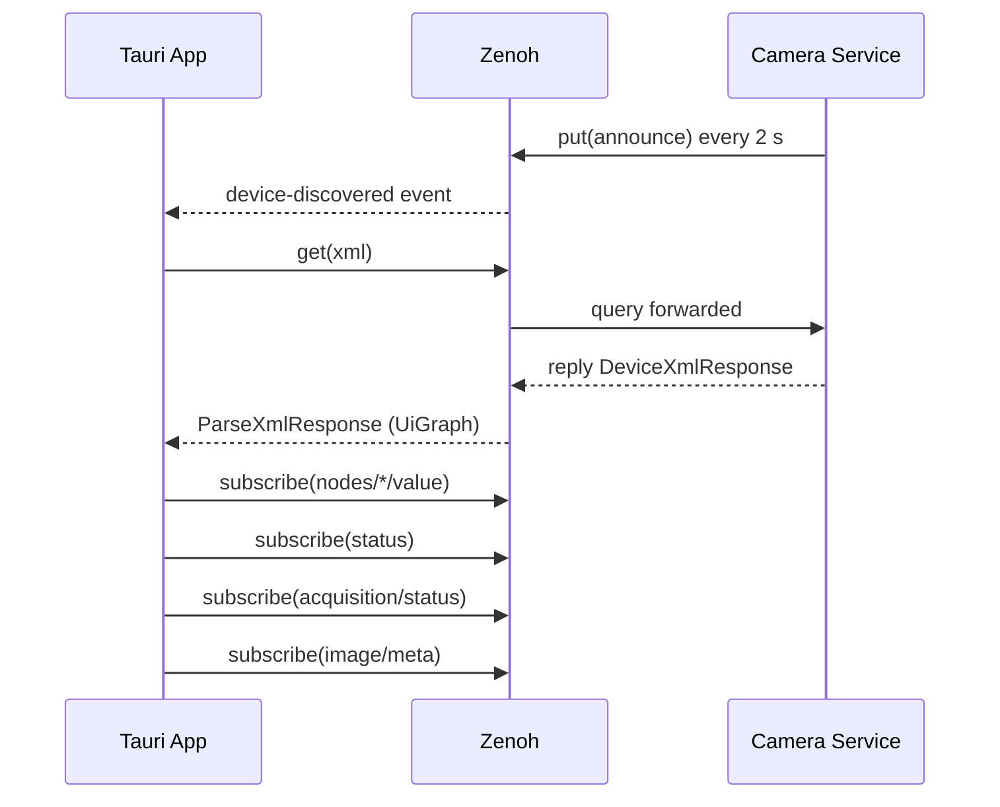
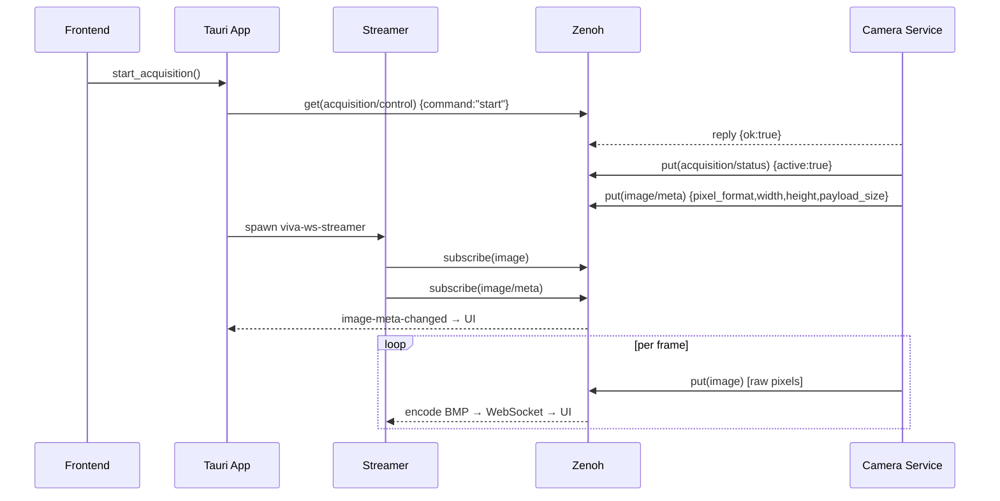

# GenICam Studio — Zenoh API Contract

This document defines the Zenoh key schema, payload types, and interaction semantics
between the external camera service and GenICam Studio (Tauri shell).

## Key Naming Convention

All keys are prefixed with `genicam/devices/{device_id}/` where `device_id` is a short
stable identifier for the camera device (e.g., `cam0`, a serial-number slug, or any
opaque string without `/`).

---

## Discovery

### `genicam/devices/{device_id}/announce`

- **Direction:** Camera service → App
- **Mechanism:** `put` (publisher), periodic, e.g. every 2 seconds
- **Payload (JSON):**
  ```json
  {
    "id": "cam-000cdf065b2f",
    "name": "Left",
    "model": "SPC-3000",
    "serial": "SN12345678",
    "api_version": 4,
    "ip": "192.168.1.10",
    "mac": "00:0C:DF:06:5B:2F",
    "user_name": "Left",
    "manufacturer": "Sony"
  }
  ```
- **Rust type:** `DeviceAnnounce` in `viva-zenoh-api`
- **Semantics:** The app subscribes to `genicam/devices/*/announce`. Any device not seen
  for more than 6 seconds is considered lost and removed from the discovered list.
- **Identity:** for GigE Vision, `id` is `cam-` plus the MAC as lowercase hex
  (`viva_zenoh_api::gige_device_id`) — the one identifier that survives an address
  change. `name` is the user-defined name, else the model, else the address. `serial` is
  the device's own serial, empty when it reports none (services before version 3 put the
  device id there). `ip`, `mac`, `user_name` and `manufacturer` are optional and absent
  when unknown; USB3 Vision has no `ip` or `mac`. The app labels a device by its
  user-defined name, else serial, else address, so identical cameras stay distinguishable
  ([#137](https://github.com/VitalyVorobyev/viva-genicam/issues/137)).
- **`api_version`:** Optional (`null`/absent means the service is pre-versioning). The app
  compares this against `viva_zenoh_api::API_VERSION` (currently `4`). On mismatch or
  absence, the app emits an `api-version-mismatch` Tauri event (see below) and still
  discovers the device — no hard rejection.

---

## Connection Lifecycle

### `genicam/devices/{device_id}/xml`

- **Direction:** App → Service (queryable GET)
- **Mechanism:** Zenoh queryable; app issues `get()` with empty payload
- **Response (JSON):**
  ```json
  { "xml": "<RegisterDescription>...</RegisterDescription>" }
  ```
- **Rust type:** `DeviceXmlResponse` in `viva-zenoh-api`
- **Semantics:** Full GenICam XML string. The app parses this into the UiGraph model on
  connect. Response should be stable during a session.

### `genicam/devices/{device_id}/status`

- **Direction:** Service → App
- **Mechanism:** `put` on change
- **Payload (JSON):**
  ```json
  { "connected": true, "error": null }
  { "connected": false, "error": "USB link lost" }
  ```
- **Rust type:** `DeviceStatus` in `viva-zenoh-api`
- **Semantics:** App subscribes on connect. Loss of connection triggers
  `connection-state-changed` Tauri event.

---

## Node Values

### `genicam/devices/{device_id}/nodes/{node_name}/value`

- **Direction:** Service → App
- **Mechanism:** `put` on change (service-owned)
- **Payload (JSON):**
  ```json
  { "value": 1024, "access_mode": "RW" }
  { "value": "Continuous", "access_mode": "RW" }
  { "value": true, "access_mode": "RO" }
  { "value": 640, "access_mode": "RW", "min": 1.0, "max": 4096.0, "inc": 1.0 }
  ```
- **Rust type:** `NodeValueUpdate` in `viva-zenoh-api`
- **Semantics:** The app maintains a local `NodeValueCache` updated by these messages.
  `access_mode` is one of `RO`, `WO`, `RW`, `NA`.
  `min`, `max`, `inc` are **optional** runtime constraint hints (ZA-06). When present,
  the UI can tighten slider ranges without re-parsing XML. Services that do not implement
  constraint propagation may omit them; the UI falls back to XML-parsed static constraints.

### `genicam/devices/{device_id}/nodes/{node_name}/set`

- **Direction:** App → Service (queryable GET)
- **Mechanism:** App issues `get()` with JSON payload
- **Request (JSON):**
  ```json
  { "value": 2048 }
  ```
- **Response (JSON):**
  ```json
  { "ok": true, "error": null }
  { "ok": false, "error": "Value out of range" }
  ```
- **Rust type:** request: `NodeSetRequest`; response: `NodeOpResponse` — both in `viva-zenoh-api`
- **Semantics:** Synchronous write. On success the service publishes the new value to
  `nodes/{name}/value`.

### `genicam/devices/{device_id}/nodes/{node_name}/execute`

- **Direction:** App → Service (queryable GET)
- **Mechanism:** App issues `get()` with empty payload
- **Response (JSON):**
  ```json
  { "ok": true, "error": null }
  ```
- **Rust type:** `NodeOpResponse` in `viva-zenoh-api`
- **Semantics:** Executes a GenICam Command node.

### `genicam/devices/{device_id}/nodes/bulk/read`

- **Direction:** App → Service (queryable GET)
- **Request (JSON):** `{ "names": ["ExposureTime", "Gain", "Width"] }`
- **Response (JSON):**
  ```json
  {
    "values": {
      "ExposureTime": { "value": 10000.0, "access_mode": "RW" },
      "Gain":         { "value": 1.0,     "access_mode": "RW" }
    }
  }
  ```
- **Rust type:** request: `BulkReadRequest`; response: `BulkReadResponse` — both in `viva_zenoh_api`
- **Semantics:** Batch read of multiple node values in a single round-trip. Unknown node names are silently omitted. An empty `names` list returns an empty `values` map. The per-entry shape is identical to `nodes/{name}/value`.

### `genicam/devices/{device_id}/nodes/{node_name}/state` *(API v2)*

- **Direction:** Service → App (subscribe) + App → Service (queryable GET)
- **Mechanism:** `put` on change **and** queryable reply
- **Payload (JSON):** a `FeatureState` object:
  ```json
  {
    "value": 1920,
    "access_mode": "RW",
    "kind": "Integer",
    "is_implemented": true,
    "is_available": true,
    "numeric": { "min": 16, "max": 4096, "inc": 8 },
    "unit": "px"
  }
  ```
  Enumeration nodes also carry `"enum_available": ["Off", "Once"]`.
  A feature with nothing to read — a Category, a Command, a node declared
  `WO`, or the register a command writes through — carries `"value": null`
  and is never read from the device. It is still reported, with its access
  mode, so the client can offer the write or the execute:
  ```json
  { "value": null, "access_mode": "WO", "kind": "Command", "is_implemented": true, "is_available": true }
  ```
- **Rust type:** `FeatureState` in `viva_zenoh_api`
- **Semantics:** Authoritative live state of a feature. `min/max/inc` apply to the current selector context; `enum_available` is the set of entries the device reports as currently implemented/available. The legacy `nodes/{name}/value` key continues to be published in parallel for backward compatibility and is populated from the same `FeatureState` via `FeatureState::to_node_value_update`. Clients that speak API v2 should prefer this key.

### `genicam/devices/{device_id}/nodes/bulk/state` *(API v2)*

- **Direction:** App → Service (queryable GET)
- **Request (JSON):** `{ "names": ["ExposureTime", "PixelFormat", "Width"] }` (same shape as `BulkReadRequest`)
- **Response (JSON):** a `HashMap<String, FeatureState>`:
  ```json
  {
    "PixelFormat": {
      "value": "Mono8",
      "access_mode": "RW",
      "kind": "Enumeration",
      "is_implemented": true,
      "is_available": true,
      "enum_available": ["Mono8", "Mono16"]
    },
    "Width": {
      "value": 1920,
      "access_mode": "RW",
      "kind": "Integer",
      "is_implemented": true,
      "is_available": true,
      "numeric": { "min": 16, "max": 4096, "inc": 8 }
    }
  }
  ```
- **Rust type:** request: `BulkReadRequest`; response: `HashMap<String, FeatureState>` — types in `viva_zenoh_api`
- **Semantics:** Batch introspection. Names whose state cannot be built are silently omitted (same as `nodes/bulk/read`); write-only and command nodes are not among them — they are reported with `"value": null`.

---

## Acquisition

### `genicam/devices/{device_id}/acquisition/control`

- **Direction:** App → Service (queryable GET)
- **Mechanism:** App issues `get()` with JSON payload
- **Request (JSON):**
  ```json
  { "command": "start" }
  { "command": "stop" }
  ```
- **Response (JSON):**
  ```json
  { "ok": true, "error": null }
  ```
- **Rust type:** request: `AcquisitionControlRequest { command: AcquisitionCommand }`; response: `NodeOpResponse` — both in `viva-zenoh-api`. `AcquisitionCommand` serializes as `"start"` or `"stop"` (`#[serde(rename_all = "lowercase")]`).
- **Semantics:** Start/stop hardware acquisition. On success the service begins/stops
  publishing to `image` — or to `evs`, for an event-vision camera.

### `genicam/devices/{device_id}/acquisition/status`

- **Direction:** Service → App
- **Mechanism:** `put` on change
- **Payload (JSON):**
  ```json
  { "active": true, "fps": 29.97, "dropped": 0 }
  { "active": false, "fps": null, "dropped": 0 }
  ```
- **Rust type:** `AcquisitionStatus` in `viva-zenoh-api`

### `genicam/devices/{device_id}/image`

- **Direction:** Service → Streamer (NOT consumed by Tauri directly)
- **Mechanism:** `put` per frame
- **Payload:** 16-byte binary [`FrameHeader`] immediately followed by raw pixel data (row-major,
  no further encoding). The header makes every frame self-describing — consumers do not need to
  rely on a prior `image/meta` subscription.
- **Consumer:** `viva-ws-streamer` subscribes to this key and broadcasts BMP-encoded
  frames over WebSocket. The Tauri app does **not** subscribe to this key directly.

#### Binary frame header layout (16 bytes, all fields little-endian)

| Offset | Size | Field    | Description                                              |
|--------|------|----------|----------------------------------------------------------|
| 0      | 2    | `magic`  | `0x4746` LE (`[0x46, 0x47]`) — frame marker             |
| 2      | 1    | `version`| Header layout version; currently `1`                    |
| 3      | 1    | `format` | Pixel format discriminant (see table below)              |
| 4      | 4    | `width`  | Image width in pixels, `u32` LE                          |
| 8      | 4    | `height` | Image height in pixels, `u32` LE                         |
| 12     | 4    | `seq`    | Monotonically increasing frame counter, `u32` LE         |

#### Pixel format discriminant table

Codes are **only appended** — never reordered. Unknown codes map to `PixelFormat::Unknown`.

| Code | `PixelFormat` variant | Notes               |
|------|----------------------|---------------------|
|    0 | `Unknown`            | fallback / unset    |
|    1 | `Mono8`              | 1 byte/px           |
|    2 | `Mono10`             | 2 bytes/px (LE)     |
|    3 | `Mono12`             | 2 bytes/px (LE)     |
|    4 | `Mono16`             | 2 bytes/px (LE)     |
|    5 | `BayerRG8`           | 1 byte/px           |
|    6 | `BayerGR8`           | 1 byte/px           |
|    7 | `BayerBG8`           | 1 byte/px           |
|    8 | `BayerGB8`           | 1 byte/px           |
|    9 | `BayerRG10`          | 2 bytes/px (LE)     |
|   10 | `BayerGR10`          | 2 bytes/px (LE)     |
|   11 | `BayerBG10`          | 2 bytes/px (LE)     |
|   12 | `BayerGB10`          | 2 bytes/px (LE)     |
|   13 | `BayerRG12`          | 2 bytes/px (LE)     |
|   14 | `BayerGR12`          | 2 bytes/px (LE)     |
|   15 | `BayerBG12`          | 2 bytes/px (LE)     |
|   16 | `BayerGB12`          | 2 bytes/px (LE)     |
|   17 | `BayerRG16`          | 2 bytes/px (LE)     |
|   18 | `BayerGR16`          | 2 bytes/px (LE)     |
|   19 | `BayerBG16`          | 2 bytes/px (LE)     |
|   20 | `BayerGB16`          | 2 bytes/px (LE)     |
|   21 | `RGB8`               | 3 bytes/px          |
|   22 | `BGR8`               | 3 bytes/px          |
|   23 | `RGBa8`              | 4 bytes/px          |
|   24 | `YCbCr422_8`         | 2 bytes/px          |
|   25 | `YCbCr8`             | 3 bytes/px          |
|   26 | `Coord3D_C16`        | 2 bytes/px (LE)     |

- **Rust types:** `FrameHeader`, `FrameHeaderError`, `FRAME_MAGIC`, `HEADER_SIZE`,
  `pixel_format_to_u8`, `u8_to_pixel_format` — all in `viva_zenoh_api::frame_header`.

### `genicam/devices/{device_id}/image/meta`

- **Direction:** Service → App and Streamer
- **Mechanism:** `put` on acquisition start; re-published whenever Width, Height, or
  PixelFormat node values change while acquisition is active
- **Consumers:**
  - **viva-ws-streamer** (ST-01): subscribes to reconfigure its BMP encoder when
    dimensions or format change.
  - **Tauri app** (TB-01): subscribes and stores the latest value in
    `AcquisitionInner.image_meta`; emits `image-meta-changed` event to the frontend.
- **Payload (JSON):**
  ```json
  { "pixel_format": "Mono8", "width": 1920, "height": 1080, "payload_size": 2073600 }
  ```
- **Rust type:** `ImageMeta` in `viva-zenoh-api`
- **Field notes:**
  - `pixel_format` — SFNC format string (e.g. `"Mono8"`, `"Mono16"`, `"BayerRG8"`,
    `"RGB8"`). Full variant list: `viva_zenoh_api::PixelFormat`. Unknown strings
    deserialize as `PixelFormat::Unknown`.
  - `payload_size` — `width × height × bytes_per_pixel` for the given format.
    See `PixelFormat::bytes_per_pixel()` for the authoritative mapping.

### `genicam/devices/{device_id}/evs`

- **Direction:** Service → subscribers (Studio does not consume it yet)
- **Mechanism:** `put` per event block
- **Payload:** 24-byte binary [`EvsHeader`] immediately followed by the encoded events,
  exactly as the camera sent them.
- **Semantics:** An event-vision camera (a LUCID Triton2 EVS streaming Prophesee EVT 3.0 or
  EVT 2.1, [#138](https://github.com/VitalyVorobyev/viva-genicam/issues/138)) sends events,
  not pixels. Its blocks go here and **never** on `image`: they have no image geometry, and
  the GVSP leader's Size X / Size Y do not describe one. Services before API version 4
  published them on `image` as a `1 × N` frame in a format that decodes as `Unknown`.
  Named `evs` rather than `events` so it cannot be confused with GenICam device events.

#### Binary event-block header layout (24 bytes, all fields little-endian)

| Offset | Size | Field         | Description                                            |
|--------|------|---------------|--------------------------------------------------------|
| 0      | 2    | `magic`       | `0x5645` LE (`[0x45, 0x56]`, `"EV"`) — event marker    |
| 2      | 1    | `version`     | Header layout version; currently `1`                   |
| 3      | 1    | `format`      | `0` Unknown, `1` EVT 3.0, `2` EVT 2.1; codes only appended |
| 4      | 4    | `seq`         | Event-block counter, from `0` per acquisition, `u32` LE |
| 8      | 8    | `timestamp`   | Device timestamp, `u64` LE; valid only if flag bit 0   |
| 16     | 4    | `payload_len` | Bytes of event data that follow, `u32` LE              |
| 20     | 1    | `flags`       | Bit 0: `timestamp` is present                          |
| 21     | 3    | reserved      | Zero                                                   |

- **Rust types:** `EvsHeader` (build with `EvsHeader::new`; `#[non_exhaustive]`),
  `EvsFormat`, `EvsHeaderError`, `EVS_MAGIC`, `EVS_HEADER_SIZE` — in
  `viva_zenoh_api::evs_header`. `EvsHeader::decode` rejects a message whose `payload_len`
  disagrees with the bytes that follow.

---

## Timing Guarantees

| Key | Expected frequency |
|-----|--------------------|
| `announce` | Every 2 s (informational) |
| `nodes/*/value` | On parameter change (up to ~100 Hz for fast nodes) |
| `acquisition/status` | On change |
| `image` | At acquisition frame rate |
| `evs` | Per event block, while an event-vision camera acquires |
| `image/meta` | On acquisition start; on Width, Height, or PixelFormat change during active acquisition |

Device is considered lost if `announce` is not received for 6 seconds.

---

## Error Semantics

- All Zenoh `get()` calls to service queryables expect a single reply within 5 seconds.
- Timeout or Zenoh-level error → surfaced as `"Zenoh timeout or error"`.
- Service-level error → returned in `{ "ok": false, "error": "..." }` response body.
- The app never puts to `image` or `nodes/*/value` — those are service-owned.

---

## Sequence Diagrams

### Device Connect



### Acquisition



---

## Tauri IPC Commands (App Internal)

| Command | Direction | Description |
|---------|-----------|-------------|
| `list_discovered_devices()` | → `Vec<DeviceInfo>` | Current discovered device list |
| `connect_device(device_id)` | → `ParseXmlResponse` | Connect and fetch XML |
| `disconnect_device()` | → `()` | Clean up subscriptions |
| `get_connection_state()` | → `ConnectionState` | Current state enum |
| `write_node(node_name, value)` | → `()` | Write node via Zenoh queryable |
| `execute_command(node_name)` | → `()` | Execute Command node |
| `get_node_value(node_name)` | → `NodeValueEntry` | Read from local cache |
| `start_acquisition()` | → `StreamerInfo` | Start acq + launch streamer sidecar |
| `stop_acquisition()` | → `()` | Stop acq + kill streamer |
| `get_acquisition_status()` | → `AcquisitionStatus` | Current acquisition state |

## Tauri Events (Backend → Frontend)

| Event | Payload | Description |
|-------|---------|-------------|
| `device-discovered` | `DeviceInfo` | New device seen on Zenoh |
| `device-lost` | `{ device_id: string }` | Device announce timed out |
| `api-version-mismatch` | `{ device_id: string, device_version: number \| null, app_version: number }` | Emitted once per device on first discovery when `api_version` is absent or differs from `API_VERSION`; device is still discovered |
| `node-value-changed` | `{ node_name, value, access_mode, min?, max?, inc? }` | Live node update; `min`/`max`/`inc` present when service provides runtime constraints |
| `acquisition-status` | `AcquisitionStatus` | Acquisition state change |
| `connection-state-changed` | `ConnectionState` | Connect/disconnect/error |
| `image-meta-changed` | `ImageMeta` | Image format or dimension change; emitted by TB-01 on each image/meta Zenoh update |
| `streamer-status` | `StreamerStatus` | Streamer process lifecycle event: started, crashed (with restart), stopped. Fields: `running: bool`, `error: string \| null`, `restart_count: number`. |
| `disconnect-reason` | `DisconnectReason` | Emitted when service signals `{ connected: false }`. Fields: `message: string`, `device_id: string`. Used to display a reconnect prompt. |
